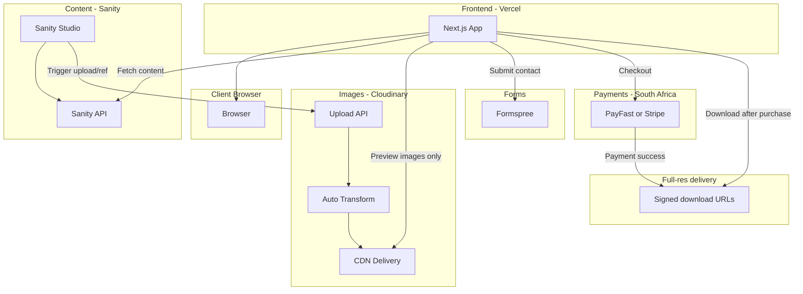

# Photography Website – Full Architecture & Development Plan

---

## 1. Recommended Tech Stack (Beginner-Friendly + Professional)

| Layer                   | Recommendation                                                                  | Why                                                                                                                                             |
| ----------------------- | ------------------------------------------------------------------------------- | ----------------------------------------------------------------------------------------------------------------------------------------------- |
| **Frontend**            | **Next.js (React)** or **Astro**                                                | Next.js: great SEO, image optimization built-in, easy deploy to Vercel. Astro: even simpler, less JS, faster if you want mostly static content. |
| **Content & events**    | **Headless CMS** (e.g. **Sanity**, **Strapi**, or **Decap CMS** + Markdown)     | Edit events and gallery metadata in a UI; no custom admin backend to build. Sanity has a generous free tier and great media handling.           |
| **Database**            | **Same as CMS** (Sanity/Strapi have built-in data) or **Supabase** (PostgreSQL) | Avoid managing a separate DB; CMS or Supabase cover events, gallery metadata, and (optionally) contact form storage.                            |
| **Image storage & CDN** | **Cloudinary** or **Vercel Blob + Image Optimization**                          | Automatic resizing, formats (WebP/AVIF), and CDN delivery. Cloudinary free tier is generous; Vercel fits if you stay on Vercel.                 |
| **Hosting**             | **Vercel** (frontend) or **Netlify**                                            | Free tier, Git-based deploys, serverless. Fits Next.js/Astro perfectly.                                                                         |
| **Forms**               | **Formspree**, **Netlify Forms**, or **Supabase**                               | No backend needed; cheap/free and simple.                                                                                                       |
| **Payments (ZA)**       | **PayFast** or **Stripe**                                                       | PayFast: dominant in South Africa, ZAR, EFT/card. Stripe: global, works in SA; use if you want international sales too.                         |

**Suggested “simple” combo:** **Next.js + Sanity + Cloudinary + Vercel + Formspree + PayFast (or Stripe).**

- One framework, one CMS, one image provider, one host, one form service, one payment provider.
- All have free tiers and scale to thousands of photos; PayFast has no monthly fee, per-transaction only.

---

## 2. Full Site Architecture

- **Frontend (Vercel):** Next.js app. Fetches content from Sanity, renders pages, and uses Cloudinary URLs (or Sanity’s image pipeline) for all images.
- **Content (Sanity):** Events, gallery metadata, featured images, and references to assets. Sanity can store image references; you can either use Sanity’s image CDN or store “processed” image URLs from Cloudinary.
- **Images:** Upload originals to **Cloudinary** (or Sanity). **On the website, only serve low-res watermarked previews**; full-resolution files are never exposed in the frontend. Full-res is delivered only after purchase via time-limited signed URLs.
- **Forms:** Contact (and optional newsletter) go to Formspree (or Netlify Forms); no custom backend.
- **Payments:** PayFast (South Africa: ZAR, EFT, cards) or Stripe; checkout creates an order and triggers secure full-res delivery (see sections below).

**Data flow (high level):**

- You (or an upload flow) create “Event” and “Gallery” documents in Sanity and associate images (Cloudinary URLs or Sanity assets).
- Next.js fetches these via Sanity client and builds the home page (hero, featured gallery, next 3 events, recent galleries).
- All image URLs point to Cloudinary (or Sanity) with size/quality params so delivery is fast and automatic.

---

## 3. Photo Upload → Optimization → Gallery Display (Automatic Flow)

Goal: **upload once** → **optimize and store** → **show up in the right galleries** with no manual file shuffling.

**Option A – Sanity + Cloudinary (recommended for “upload once, display everywhere”)**

1. **Upload:**
  - Use **Cloudinary unsigned upload** from the browser (e.g. from Sanity Studio custom component or a small “upload” page), or
  - Use **Sanity’s asset pipeline**: upload to Sanity, then an **export script or Sanity webhook** sends new assets to Cloudinary for processing and stores the Cloudinary URL back in Sanity.
2. **Optimization:**
  - Cloudinary: on-the-fly transforms (e.g. `w_1200,f_auto,q_auto`) or **eager transformations** so pre-sized images are generated once and cached.
3. **Display:**
  - Sanity documents hold: event, gallery, and “featured” flags plus the image URL (Cloudinary or Sanity).
  - Next.js reads Sanity, renders `` or `next/image` with those URLs. No duplicate “upload to website” step.

**Option B – Simpler: Sanity-only images**

1. **Upload:** Directly in Sanity Studio (drag-and-drop into Event or Gallery).
2. **Optimization:** Use **Sanity’s image URL builder** (`@sanity/image-url`) with width, quality, and format (e.g. WebP). Sanity serves optimized images from their CDN.
3. **Display:** Same as above: frontend fetches from Sanity and uses the built image URLs.

**Recommended for you:** Start with **Option B** (Sanity-only). When you hit scale or want more control, add Cloudinary and move to Option A. That keeps the flow “upload in Sanity → automatically available in the site” with zero extra steps.

**Concrete “automatic” flow:**

1. You create an **Event** in Sanity (title, date, venue, cover image, “featured” toggle).
2. You create a **Gallery** linked to that event and add photos (Sanity asset references).
3. Frontend queries: “Events where date >= today, order by date asc, limit 3” and “Galleries, order by date desc, limit N.”
4. Home page hero and “featured gallery” come from a “Featured” or “Home” document in Sanity.
5. No manual “publish to website” step beyond publishing in Sanity; the site is driven by published content.

---

## 3b. Photo Purchasing (South Africa)

**Goal:** Customer browses a gallery, selects one or more photos to buy, pays in ZAR (or card), and receives a secure download link for full-resolution, unwatermarked files.

**Payment providers for South Africa:**

- **PayFast** – Most common in SA. Supports ZAR, EFT, debit/credit cards, SnapScan, and others. No monthly fee; per-transaction only. Easy integration via redirect or API; IPN (Instant Payment Notification) confirms success so you can trigger delivery.
- **Stripe** – Works in South Africa; good if you also want international customers. Card payments; no ZAR EFT but broader currency support.

**Purchasing flow (high level):**

1. **Browse:** Customer views a gallery; all images shown are **preview-only** (low-res + watermark). Each image has an "Add to cart" or "Buy" option (with price; price can live in Sanity per image or per size).
2. **Cart:** Simple cart (e.g. React state or persisted in `localStorage`) holds: image ID, title, chosen size/format, price. Cart page shows summary and total in ZAR.
3. **Checkout:** Customer clicks "Checkout" → redirect to **PayFast** (or Stripe Checkout) with order total, your merchant ID, return/cancel URLs, and a unique order reference. You pass the order payload (e.g. as custom field or via your backend) so you know which images to deliver.
4. **Payment:** Customer pays on PayFast/Stripe. Gateway redirects back to your site and sends a server-to-server **webhook / IPN** (PayFast: "Notify" URL) with payment status.
5. **Order handling:** A small backend (e.g. **Vercel Serverless Function** or **Supabase Edge Function**) receives the webhook, verifies the signature, creates an "Order" record (in Sanity or Supabase) with status "paid", and generates **time-limited signed download URLs** for the full-res files (see Photo protection below).
6. **Delivery:** Customer lands on a "Thank you" or "My purchases" page. Show a list of orders with **Download** buttons that use the signed URLs. Optionally email the same links (e.g. via Resend or SendGrid) so they can download later. Links expire (e.g. 72 hours or 7 days) to limit sharing.

**What you need to implement:**

- **Product/price data:** In Sanity, each sellable image (or gallery) has: base price, optional sizes (e.g. web vs print), and a reference to the **full-res asset** (stored in Cloudinary or Sanity; never linked on the public site).
- **Cart + checkout UI:** Frontend cart; checkout button builds the payload and redirects to PayFast/Stripe.
- **Webhook endpoint:** One serverless function that PayFast/Stripe call on payment success; it creates the order and generates signed URLs. Store orders in Supabase or Sanity (e.g. "Order" document type with `customerEmail`, `items[]`, `downloadUrls[]`, `expiresAt`).
- **Download page:** Authenticated by a unique token (e.g. order ID + short secret in the URL) so only the buyer can see their links. No login required if you use one-time links in the email.

**South Africa–specific:** Use **ZAR** as currency in PayFast. Consider EFT and SnapScan for lower fees and familiarity. Terms and conditions and refund policy should be clearly linked at checkout (good practice and often required by gateways).

---

## 3c. Photo Protection (Stopping Screenshots and Unauthorized Use)

**Reality:** You cannot fully prevent someone from photographing the screen or using screen capture. The goal is to make **casual theft pointless** and make the **paid product clearly better** so most people buy.

**Strategy: layered protection**

| Layer                                   | What you do                                                                                                                                                                                                                                                                                                                       | Why it helps                                                                                     |
| --------------------------------------- | --------------------------------------------------------------------------------------------------------------------------------------------------------------------------------------------------------------------------------------------------------------------------------------------------------------------------------- | ------------------------------------------------------------------------------------------------ |
| **Never serve full-res on the site**    | All images shown in galleries are **preview** only: limited size (e.g. max 1200px) and compressed (e.g. 80% quality). Full-resolution originals exist only in your storage; URLs are never exposed in the frontend.                                                                                                               | Screenshot or "Save image" only gets a low-res copy; useless for printing or serious use.        |
| **Watermark previews**                  | Every image displayed on the site has a **visible watermark** (e.g. diagonal "Preview" or your logo, semi-transparent). Generate watermarked versions via Cloudinary (overlay transform) or Sanity image pipeline, or pre-generate when you upload.                                                                               | Makes it obvious the file is not the final product; discourages sharing and casual use.          |
| **Technical friction (optional)**       | Disable right-click context menu and drag on images (e.g. `onContextMenu` preventDefault, `draggable={false}`). Optionally use a transparent overlay in the lightbox.                                                                                                                                                             | Does not stop determined users (dev tools, screenshot tools) but reduces casual "Save image as". |
| **Deliver full-res only after payment** | Full-resolution, **unwatermarked** files are stored in a private bucket (Cloudinary restricted folder, or Sanity private asset). After payment, your webhook creates **signed URLs** (e.g. Cloudinary signed delivery, or presigned S3/Blob URLs) that expire in 24–72 hours (or 7 days). Customer downloads from that link only. | Only paying customers get the real file; no full-res URL is ever on the public page.             |

**Implementation outline:**

1. **Preview URLs (public):** In Sanity/Cloudinary, for each image you define a "preview" URL: e.g. `w_1200,q_80` plus a watermark overlay. Only this URL is used in the gallery and lightbox. The "original" or "full" asset is never linked in the frontend.
2. **Watermarking:** With **Cloudinary**, use the overlay API (e.g. add a text or image overlay). With **Sanity**, you can use image URL builder with limited size/quality; for a visible watermark you'd either use Cloudinary for previews or a small serverless function that overlays and returns the image. Easiest: use Cloudinary for all display images and add a global overlay transform for "preview" tag.
3. **Full-res storage:** Keep originals in Cloudinary (private or restricted) or in a private Sanity dataset. Your webhook, after payment, uses the backend/API to generate a signed URL (Cloudinary: signed delivery; Vercel Blob/S3: presigned URL) pointing to the unwatermarked original, with expiry.
4. **One-time or limited downloads:** Optionally cap the number of times the signed URL can be used (e.g. 3 downloads). Some CDNs support this; otherwise you track in your DB and invalidate after N uses.

**Summary:** Public site = low-res + watermark + optional right-click disable. Paid delivery = time-limited signed link to full-res, unwatermarked file. This keeps the site fast, deters casual copying, and makes buying the only way to get a usable file.

---

## 4. Page Structure

| Page                         | Route                              | Purpose                                                                                                                                                |
| ---------------------------- | ---------------------------------- | ------------------------------------------------------------------------------------------------------------------------------------------------------ |
| **Home**                     | `/`                                | Hero (one strong image or short slider), short intro, featured gallery (grid), “Next 3 events”, “Recent galleries” links, CTA to galleries or contact. |
| **Events**                   | `/events`                          | List all upcoming (and optionally past) events; each links to its gallery.                                                                             |
| **Event detail**             | `/events/[slug]`                   | Single event info + link to “View gallery”.                                                                                                            |
| **Galleries**                | `/galleries`                       | List galleries (thumbnails + titles); filter by event if needed.                                                                                       |
| **Gallery**                  | `/galleries/[slug]`                | Protected previews (low-res + watermark), lightbox, **Add to cart** per photo; prices from Sanity.                                                     |
| **Cart**                     | `/cart`                            | List items, total in ZAR, **Checkout** button to PayFast or Stripe.                                                                                    |
| **Thank you / My purchases** | `/order/[orderId]` or `/purchases` | After payment: order summary and **Download** links (signed, time-limited) for full-res files; optional email.                                         |
| **Contact**                  | `/contact`                         | Form (Formspree), optional map, social links.                                                                                                          |
| **Admin**                    | `/admin` or separate URL           | Sanity Studio (or Decap CMS) for events/galleries; or Cloudinary upload UI. No custom “admin app” needed.                                              |

**SEO:**

- Next.js: use `metadata` / `generateMetadata` for title and description per page.
- Use semantic HTML (e.g. `<main>`, `<article>`, headings in order).
- Sitemap and `robots.txt` (Next.js can generate these).

**Mobile:**

- Responsive layout (CSS Grid/Flexbox), touch-friendly gallery (swipe, large tap targets).
- Use `next/image` (or Astro’s image component) for lazy loading and `srcset` so images are small on mobile.

---

## 5. Hosting and Storage (Cheap and Fast)

- **Frontend:** **Vercel** free tier (or Netlify). Good global CDN, automatic HTTPS, preview deploys from Git.
- **CMS:** **Sanity** free tier (generous; pay as you grow). Hosted; no server to maintain.
- **Images:**
  - **Sanity:** Included in free tier; their CDN is fast.
  - **Cloudinary:** Free tier (e.g. 25 credits/month); use for originals + transforms; CDN worldwide.
- **Forms:** **Formspree** free tier (e.g. 50 submissions/month) or **Netlify Forms** if you host on Netlify.
- **Domain:** Any registrar (e.g. Namecheap, Cloudflare). Point DNS to Vercel/Netlify.

**Rough monthly cost at start:** $0–15 (domain + optional paid tiers only when you need them).

---

## 6. Development Steps (Order)

0. **Repository and initial commit**
  - Create the project directory and **initialize Git** with a **good initial commit**: include a clear `.gitignore` (dependencies, env, build output, OS files), a **README.md** (project name, short description, tech stack, and “Setup” / “Development” placeholders), and an **.env.example** (all required env var names with no secrets). Optionally add a **LICENSE** file. Do not commit `node_modules`, `.env`, or secrets. This sets a clean, professional baseline for the repo before adding app code.
1. **Scaffold and deploy**
  - Create Next.js app in the repo, connect to **GitHub**, push the initial commit (or a scaffold commit). Ensure the repo is documented from the start (see Section 6c). Connect to Vercel so every push updates the site.
2. **Sanity project**
  - Create Sanity project, define schemas: `Event`, `Gallery`, `GalleryImage`, `SiteConfig` (hero, featured gallery ref).
  - Run Sanity Studio locally; add to repo (e.g. `/studio` or separate project).
3. **Data and content**
  - Implement Sanity client in Next.js; fetch “upcoming events”, “recent galleries”, “featured”.
  - Create one event and one gallery with images in Sanity to test.
4. **Home page**
  - Build layout: hero, featured gallery grid, “Next 3 events” block, “Recent galleries” links.
  - Use `next/image` with Sanity image URLs (or Cloudinary) and responsive sizes.
5. **Events and galleries**
  - `/events` and `/events/[slug]` (from Sanity).
  - `/galleries` and `/galleries/[slug]` with protected previews (preview URLs only, watermark via Cloudinary or overlay), lightbox, and **Add to cart** with prices from Sanity.
6. **Cart and checkout**
  - Cart page (`/cart`) and redirect to PayFast (or Stripe) with order payload. Implement **webhook** (Vercel serverless or Supabase) to verify payment, create Order, generate signed download URLs; store orders in Supabase or Sanity.
7. **Order confirmation and downloads**
  - Thank-you page and `/order/[id]` (or token-based link) with download links; optional email. Full-res only via signed, expiring URLs.
8. **Contact**
  - Contact page + Formspree (or Netlify Forms); basic validation and thank-you message.
9. **Polish**
  - SEO (metadata, sitemap, robots), Lighthouse, accessibility. Optional: disable right-click/drag on gallery images.
10. **Optional: Cloudinary**
  - For uploads and preview transforms + watermark overlay; keep full-res in private storage for delivery only.

---

## 6b. UI/UX and tools – agent implementation guidance

When implementing the front-end, the agent **must** use the best available tools and MCPs to achieve a high-quality, professional UI/UX. Apply the following.

**Required and optional skills**

- **Frontend-design skill (required):** The agent **must** read and follow the skill file at `**/Users/derickbotha/Documents/Coding/portfolio/SKILL.md**` (frontend-design) when building any UI, pages, or components. That skill defines design thinking (purpose, tone, constraints, differentiation), aesthetics (typography, color, motion, spatial composition, backgrounds), and rules to avoid generic AI aesthetics (e.g. no Inter/Roboto, no purple-on-white clichés). Apply it so the site is distinctive, production-grade, and memorable.
- **Other skills:** Use any other skills that are relevant and available (e.g. under `.cursor/skills-cursor/` or provided by the user) for design, accessibility, tooling, or project conventions when they help deliver better UI/UX or implementation quality.

**Component library and design system**

- Use a **design system or component library** for consistency and accessibility: e.g. **shadcn/ui** (React, Tailwind, Radix primitives), **Radix UI**, or **Tailwind UI**. Prefer one that is accessible (a11y), themable, and fits Next.js.
- Use **Tailwind CSS** (or the project’s chosen utility-first approach) for layout, spacing, typography, and responsive breakpoints so the site is clean and maintainable.
- For a **photography** site: prioritize clear visual hierarchy, generous whitespace, and image-first layouts (grids, lightbox, minimal chrome so photos stand out).

**MCPs and external tools (use when available)**

- **Figma MCP:** If the user provides or later adds Figma designs, use the Figma MCP server to read frames, variables, and components and generate or align code (e.g. layout, spacing, components) with the design.
- **Storybook MCP:** If the project uses Storybook, use it to list components, props, and examples so generated UI reuses existing components and stays consistent.
- **Browser / Playwright MCP:** Use any configured browser or Playwright MCP to verify responsive behavior, touch targets, and critical flows (e.g. gallery, cart, checkout) in real viewports.
- **Web fetch / search:** Use web fetch or search when needed to reference current design patterns, accessibility guidelines (e.g. WCAG), or component docs for the chosen stack.

**UX and accessibility**

- **Accessibility:** Use semantic HTML, ARIA where needed, keyboard navigation (especially in gallery lightbox and cart), sufficient color contrast, and focus styles. Prefer components that are built for a11y (e.g. Radix/shadcn).
- **Performance and perceived speed:** Lazy-load images, use `next/image` with correct `sizes`, and keep layout stable (e.g. aspect ratios or placeholders) to avoid CLS. Aim for good Core Web Vitals.
- **Mobile-first:** Ensure touch targets are large enough (e.g. 44px min), gallery is swipe-friendly, and cart/checkout work well on small screens.
- **Copy and feedback:** Use clear labels, button text (e.g. “Add to cart”, “Download”), and success/error messages (e.g. after payment, expired download link).

**Summary for the agent:** Use a solid component library + Tailwind, leverage any configured MCPs (Figma, Storybook, browser/Playwright) for design fidelity and testing, and follow a11y and photography-focused UX so the site looks and works like a professional photography and sales site.

---

## 6c. GitHub and documentation (production-grade)

The **entire project must be hosted and documented on GitHub** to the standard of a production-grade project. Apply the following from the first commit and keep it updated as the project grows.

**Repository setup**

- **GitHub repo:** All code lives in a Git repository pushed to GitHub (public or private). Use a clear repo name and description.
- **Good initial commit:** Before or immediately after scaffolding the app, make a **single, coherent initial commit** (or a small set of commits) that includes: `.gitignore`, `README.md`, `.env.example`, and optionally `LICENSE`. No half-finished or “WIP” dumps; the first commit should be something you could clone and understand. See Development Step 0.

**Documentation that must exist and be kept up to date**

- **README.md:** Project name, one-line description, tech stack (Next.js, Sanity, PayFast, etc.), prerequisites (Node version), **setup instructions** (clone, install, env vars, Sanity project ID, how to run dev and build), and pointers to deploy (e.g. Vercel). For production-grade: add a short “Project structure” or “Key directories” if helpful, and “Environment variables” (list names and purpose, not values).
- **.env.example:** Every required environment variable (e.g. `NEXT_PUBLIC_SANITY_PROJECT_ID`, `SANITY_API_TOKEN`, `PAYFAST_MERCHANT_*`, `CLOUDINARY_*`) with empty or placeholder values and a one-line comment each. No real secrets; this file is committed.
- **.gitignore:** Ignore `node_modules`, `.env`, `.env.local`, build/output dirs, IDE and OS cruft, and any secret or credential files. Keep the repo clean.
- **LICENSE:** Include a license file (e.g. MIT) so reuse and rights are clear.
- **Optional but recommended:** A short **docs/** folder or **ARCHITECTURE.md** describing high-level architecture (frontend, CMS, payments, image flow) and links to external services (Sanity, PayFast, Vercel). Update when you add major features (e.g. payments, webhooks).

**Ongoing practices**

- **Commit messages:** Use clear, conventional messages (e.g. “feat: add cart page”, “fix: gallery lightbox a11y”). The history should tell a story.
- **Branches:** Use `main` (or `master`) as the default; use feature branches for larger changes and merge via PR when appropriate.
- **Secrets:** Never commit `.env`, API keys, or webhook secrets; rely on `.env.example` and environment config (Vercel, etc.) for documentation.

**Summary:** The repo should be cloneable, buildable, and understandable by another developer. Start with a good initial commit and maintain README, .env.example, .gitignore, and LICENSE; add architecture or docs as needed so the project is documented on GitHub like a production-grade project.

---

## 7. Common Beginner Mistakes to Avoid

- **Don’t upload full-resolution images to the page.** Always use responsive/optimized URLs (Sanity image builder or Cloudinary transforms).
- **Don’t build a custom admin from scratch.** Use Sanity (or similar) so you get auth, media, and content model out of the box.
- **Don’t skip responsive images.** Use `next/image` (or equivalent) with `sizes` so mobile gets smaller images.
- **Don’t store images in the repo.** Use Sanity or Cloudinary; keep the repo for code only.
- **Don’t forget alt text.** Store captions/alt in Sanity and use them for accessibility and SEO.
- **Don’t over-engineer early.** Start with Sanity-only images; add Cloudinary only when you need it.
- **Do use environment variables** for API keys and project IDs (Sanity, Formspree, Cloudinary, PayFast/Stripe) and never commit secrets.
- **Don't serve full-res on the public site.** Use preview URLs only (size + quality limit + watermark); full-res only via signed URLs after payment.

---

## Summary

- **Stack:** Next.js + Sanity + (Sanity images first; Cloudinary later for previews + watermark) + Vercel + Formspree + **PayFast** (or Stripe) for South Africa.
- **Architecture:** Frontend on Vercel, content and product/price data in Sanity, **preview-only** images (low-res + watermark) from CDN, full-res only via signed URLs after payment; PayFast/Stripe webhook creates orders and download links.
- **Flow:** Upload in Sanity → site shows protected previews; customer adds to cart → checkout (PayFast/Stripe) → webhook generates signed full-res download URLs → customer downloads from thank-you page or email.
- **Photo protection:** Public site never serves full-res; previews are watermarked and size-limited; full-res delivered only after payment via time-limited signed URLs.
- **Pages:** Home, Events list/detail, Galleries list/detail, **Cart**, **Thank you / Order downloads**, Contact; admin = Sanity Studio.
- **Hosting:** Vercel + Sanity + optional Cloudinary; PayFast per-transaction (no monthly fee); keep cost low.
- **Order of work:** Scaffold → Sanity schemas (including prices) → home → events/galleries with protected previews and cart → PayFast/Stripe + webhook + download delivery → contact → SEO and performance.
- **UI/UX and tools:** The implementing agent must use the **frontend-design skill** at `/Users/derickbotha/Downloads/SKILL.md`, a strong component library (e.g. shadcn/ui + Tailwind), any other relevant skills, and configured MCPs (Figma, Storybook, browser/Playwright); follow a11y and photography-focused UX so the site is professional, distinctive, and maintainable.
- **GitHub and documentation:** The whole project must be on GitHub and documented to production-grade standard: start with a **good initial commit** (`.gitignore`, README, `.env.example`, optional LICENSE); maintain README (setup, env, deploy), `.env.example`, and optional ARCHITECTURE.md or docs; use clear commit messages and never commit secrets. See Section 6c.

Once you approve this plan, the next step is to generate the actual code (Next.js app, Sanity schemas, cart/checkout, webhook, and sample components) using the UI/UX and tools guidance and the required skill file(s) above, without changing anything until you confirm.